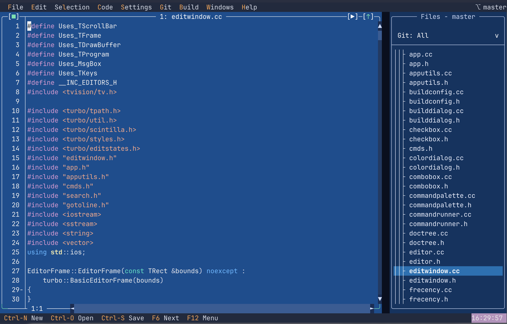

# Turbo — a lightweight terminal IDE

A small, fast, keyboard-driven IDE that runs entirely in your terminal.

> **This is a fork of [`magiblot/turbo`](https://github.com/magiblot/turbo).**
> Upstream Turbo is an experimental terminal text editor built on Neil Hodgson's
> [Scintilla](https://www.scintilla.org/index.html) editing component and the
> [Turbo Vision](https://github.com/magiblot/tvision) application framework. This
> fork builds on that foundation and grows it into a lightweight, terminal-based
> IDE, while preserving the upstream editor's behaviour. For the canonical editor,
> see the [original repository](https://github.com/magiblot/turbo).



## What this fork adds

On top of Turbo's editor core, this fork adds the building blocks of an IDE:

- **Project file tree** — a recursive view of the working directory in a side
  pane: open files straight from the tree, create new files and folders, and the
  tree stays in sync as files change on disk.
- **Light Git integration** — file status shown in the tree, and the common loop
  without leaving the editor: stage/unstage, commit, fetch/pull/push, switch
  branches, stash, and resolve merges with a conflict toolbar.
- **Integrated terminal** — a real terminal window inside the app (ConPTY on
  Windows, a PTY on Unix/macOS) for running commands alongside your code.
- **Build commands & output pane** — configure build/run commands per project
  and watch their results in a dedicated, resizable output window.
- **Language Server Protocol (LSP)** — diagnostics, completion and hover,
  configurable per language.
- **Lua scripting** — an embedded [Lua 5.4](https://www.lua.org/) interpreter to
  configure and extend the editor: run scripts from the **Lua** menu and hook
  into editor events (commit, save, file open/close, …). Scripts live in a
  project-local `.turbo/` and a global `~/.turbo/`. See
  [docs/plan_lua_scripting.md](docs/plan_lua_scripting.md).
- **Auto-save** — documents are saved automatically when their editor loses focus.
- **Latest Scintilla** — upgraded to the current Scintilla 5.5 release for editing
  improvements and a wider set of language lexers.
- **Modernised look & feel** — refreshed theming with rounded box-drawing and
  unified active/inactive styling.

## Downloads

Prebuilt binaries are attached to every [release](https://github.com/aestubbs/turbo/releases):

* `turbo-x64.exe` — 64-bit Windows (Intel/AMD).
* `turbo-x86.exe` — 32-bit Windows.
* `turbo-macos-arm64` — macOS (Apple Silicon).

For the newest per-commit builds, see the [Actions](https://github.com/aestubbs/turbo/actions)
page and download the artifacts at the bottom of a successful run (you must be
signed in to GitHub). On Linux, build from source — see [Building](#building) below.

## Building

First of all, you should clone this repository along its submodules with the `--recursive` option of `git clone`. This is **required**: the build depends on the submodules in `deps/` — Turbo Vision (`deps/tvision`), for the LSP support [nlohmann/json](https://github.com/nlohmann/json) (`deps/json`), and for scripting [Lua](https://www.lua.org/) (`deps/lua`). A non-recursive clone will fail to build with missing headers such as `nlohmann/json.hpp`.

```sh
git clone --recursive https://github.com/aestubbs/turbo.git
```

If you have already cloned the repository without `--recursive`, initialise the submodules afterwards:

```sh
git submodule update --init --recursive
```

Then, make sure the following dependencies are installed:

* CMake.
* A C++17 compiler with `std::filesystem` in the standard library: **GCC ≥ 9**,
  **Clang ≥ 9**, or **MSVC 2019+**. (Older compilers such as GCC 7/8, where
  `std::filesystem` is only in `<experimental/filesystem>`, are not supported.)
* `libncursesw` (note the 'w') (Unix only).

Additionally, you may also want to install these optional dependencies:

* `libmagic` for better recognition of file types (Unix only).
* `libgpm` for mouse support on the linux console (Linux only).
* `xsel`, `xclip` and/or `wl-clipboard` for system clipboard integration (Unix only, except macOS).

Turbo can be built with the following commands:

```sh
cmake . -DCMAKE_BUILD_TYPE=Release && # Or 'RelWithDebInfo', or 'MinSizeRel', or 'Debug'.
cmake --build .
```

The above will generate the `turbo` binary.

<details>
<summary><b>Detailed build instructions for Ubuntu 20.04</b></summary>

```sh
sudo apt update && sudo apt upgrade
sudo apt install build-essential cmake gettext-base git libgpm-dev libmagic-dev libncursesw5-dev xsel
git clone --recursive https://github.com/aestubbs/turbo.git
cd turbo
cmake . -DCMAKE_BUILD_TYPE=Release
cmake --build . -- -j$(nproc) # Build Turbo.
sudo cp turbo /usr/local/bin/ # Install (optional).
```
</details>

## Usage

### Opening a project

Pass the directory you want to work on. The most common form is `.` for the
current directory:

```sh
cd my-project
turbo .
```

Turbo scans that directory and shows it in the **Files** tree on the right; open
files by selecting them there. The integrated terminal, Git status and build
commands all operate on this same directory. You can also pass any other path
(`turbo ~/code/my-project`) or one or more files to open (`turbo main.c`).

Running `turbo` with no directory starts with no project: the **Files** tree is
empty except for your global Lua scripts, and you can still open individual files
with `Ctrl-O`.

Once running, manage the project from the **File** menu:

- **Open Directory…** — choose a folder to open as the project. Turbo only keeps
  one project open at a time, so this replaces the current one.
- **Close Project** — detach the workspace, empty the tree and close the editor
  windows whose files live inside the project. (Files opened from outside the
  project, and unsaved scratch buffers, stay open.)

Turbo remembers a project's open windows. When you close a project (or quit with
one open), the open files are written to `.turbo/session` along with each
window's position and size and each file's scroll position, selection and which
window had focus — so reopening the project puts you back exactly where you left
off. This is local state, so you may want to add `.turbo/session` to your
project's `.gitignore`.

### In-app

As said earlier, Turbo has been designed to be intuitive. So you probably already know how to use it!

Some keybindings are:

* `Ctrl+C`/`Ctrl+Ins`: copy.
* `Ctrl+V`/`Shift+Ins`: paste.
* `Ctrl+X`/`Shift+Del`: cut.
* `Ctrl+Z`, `Ctrl+Y`: undo/redo.
* `Tab`, `Shift+Tab`: indent/unindent.
* `Ctrl+E`: toggle comment.
* `Ctrl+A`: select all.
* `Shift+Arrow`: extend selection.
* `Ctrl+F`: find.
* `Ctrl+R`: replace.
* `Ctrl+G`: go to line.
* `Ctrl+Back`/`Alt+Back`, `Ctrl+Del`: erase one word left/right.
* `Ctrl+Left`/`Alt+Left`, `Ctrl+Right`/`Alt+Right`: move one word left/right.
* `Ctrl+Shift+Up`/`Alt+Shift+Up`, `Ctrl+Shift+Down`/`Alt+Shift+Down`: move selected lines up/down.
* `Ctrl+N`: create new document.
* `Ctrl+O`: "open file" dialog.
* `Ctrl+S`: save document.
* `Ctrl+W`: close focused document.
* `F6`, `Shift+F6`: next/previous document (in MRU order).
* `Ctrl+Q`/`Alt+X`: exit the application.

In environments with extended keyboard support (e.g. the Linux console, Windows or Kitty ≥ 0.20.0), the following key shortcuts may also work:

* `Ctrl+Shift+Z`: redo.
* `Ctrl+Tab`/`Alt+Tab`, `Ctrl+Shift+Tab`/`Alt+Shift+Tab`: next/previous document (in MRU order).
* `Shift+Enter`: find previous (in the "find" text box).
* `Ctrl+/`/`Ctrl+_`: toggle comment.

Support for these key combinations may vary among terminal applications, but any issue on this should be reported to [Turbo Vision](https://github.com/magiblot/tvision/issues) instead.

### Clipboard support

See the Turbo Vision [documentation](https://github.com/magiblot/tvision#clipboard).

### Lua scripting

Turbo embeds a [Lua 5.4](https://www.lua.org/) interpreter so you can configure
and extend the editor in Lua: run scripts on demand, and hook into editor events
such as save and commit. The full Lua standard library (`string`, `table`,
`math`, `io`, `os`, …) is available.

#### Where scripts live

Scripts live under a `.turbo` directory in two places:

| Location | Path | Scope |
| --- | --- | --- |
| Project-local | `<project>/.turbo/` | only this project |
| Global | `~/.turbo/` | shared across all projects |

In each location, `init.lua` runs at startup (register your event hooks here),
and `scripts/*.lua` are individual runnable scripts.

#### Running scripts

Run a script from the **Lua** menu (*Run Script…*) or the **Command Palette**
(`Ctrl+B`) — every script appears there as `Lua Script: <name>`. *Lua → New
Script…* creates one under the project's `.turbo/scripts`, and *Lua → Reload
Config* re-runs the `init.lua` files. Script windows have a brown frame so they
stand out. A script is just Lua — for example, `.turbo/scripts/hello.lua`:

```lua
-- hello.lua
if turbo.active_file() ~= "" then
  turbo.message("editing " .. turbo.active_file())
else
  turbo.message("no file open")
end
```

#### Events

In an `init.lua`, call `turbo.on(event, handler)` to react to what you do in the
editor. Turbo calls the handler with a table of parameters; for `before*`
events, returning `false` cancels the action.

```lua
-- ~/.turbo/init.lua  (global hooks)
turbo.on("afterSave", function(p)
  turbo.message("saved " .. p.path)
end)

turbo.on("beforeCommit", function(p)
  if p.message == "" then return false end   -- veto commits with an empty message
end)
```

| Event | Fires when | `params` |
| --- | --- | --- |
| `newFile` | a new empty buffer is created | — |
| `openFile` | a file is opened in an editor | `path` |
| `beforeSave` | just before a save writes to disk (cancellable) | `path` |
| `afterSave` | after a save completes | `path` |
| `closeFile` | an editor is closed | `path` |
| `beforeCommit` | commit confirmed, before git runs (cancellable) | `message` |
| `afterCommit` | a commit finishes | `ok`, `output` |

Every handler also receives `params.event` (the event name).

#### The `turbo` API

A global `turbo` table is available to every script and hook:

| Call | Effect |
| --- | --- |
| `turbo.message(s)` / `turbo.log(s)` | show a message box |
| `turbo.version()` | Turbo / Lua version string |
| `turbo.on(event, fn)` | register an event handler |
| `turbo.register_command(name, [desc,] fn)` | add a command to the palette that runs `fn` |
| `turbo.active_file()` | path of the focused editor, or `""` |
| `turbo.file_text()` | full text of the focused editor |
| `turbo.insert_text(s)` | insert text at the cursor |
| `turbo.open_file(path)` | open (or focus) a file |
| `turbo.save()` | save the focused editor |
| `turbo.run_command(id)` | dispatch a Turbo command id |
| `turbo.shell(cmd)` | run a shell command, return its stdout |
| `turbo.project_root()` | the project directory |

`turbo.register_command` adds your own entry to the Command Palette (`Ctrl+B`):

```lua
-- ~/.turbo/init.lua
turbo.register_command("Insert date", "insert today's date", function()
  turbo.insert_text(turbo.shell("date +%Y-%m-%d"))
end)
```

For the full design and details, see
[docs/plan_lua_scripting.md](docs/plan_lua_scripting.md).

## Acknowledgements

This project stands on the work of [Turbo](https://github.com/magiblot/turbo) by
magiblot, the [Turbo Vision](https://github.com/magiblot/tvision) framework, and
Neil Hodgson's [Scintilla](https://www.scintilla.org/) and
[Lexilla](https://github.com/ScintillaOrg/lexilla) editing components.
